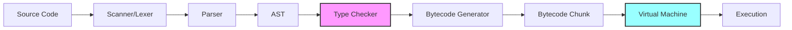

# ProXPL Bytecode Virtual Machine: Technical Deep-Dive

**Document Version:** 1.0  
**Last Updated:** December 2024  
**Target Audience:** Compiler Developers, VM Engineers, Language Implementers

---

## Table of Contents

1. [Executive Summary](#executive-summary)
2. [Architecture Overview](#architecture-overview)
3. [Value Representation](#value-representation)
4. [Bytecode Format](#bytecode-format)
5. [Stack-Based Execution Model](#stack-based-execution-model)
6. [Instruction Dispatch](#instruction-dispatch)
7. [Memory Management](#memory-management)
8. [Type Checking System](#type-checking-system)
9. [Call Frames and Functions](#call-frames-and-functions)
10. [Performance Optimizations](#performance-optimizations)
11. [Safety Guarantees](#safety-guarantees)
12. [Future Enhancements](#future-enhancements)

---

## Executive Summary

ProXPL's Virtual Machine is a **high-performance, stack-based bytecode interpreter** designed for executing ProXPL programs with C-level efficiency. The VM features:

- **NaN-Boxing value representation** for compact, fast value storage
- **Threaded dispatch** (computed goto) for optimal instruction execution
- **Mark-and-sweep garbage collector** for automatic memory management
- **Static type checking** at compile-time preventing entire classes of runtime errors
- **Call frames** for efficient function calls and local variable management
- **40+ bytecode instructions** covering arithmetic, control flow, functions, and OOP

The VM executes **optimized bytecode** generated from ProXPL source code, providing a balance between compilation speed and runtime performance.

---

## Architecture Overview

### Compilation Pipeline



### VM Components

The VM consists of several interconnected subsystems:

| Component | File | Responsibility |
|-----------|------|----------------|
| **Value System** | `include/value.h` | NaN-boxed value representation and type checking macros |
| **Bytecode** | `include/bytecode.h` | Opcode definitions and chunk structure |
| **VM Core** | `src/runtime/vm.c` | Main execution loop and instruction dispatch |
| **Call Frames** | `include/vm.h` | Function call stack management |
| **Memory** | `src/runtime/memory.c` | Allocation and deallocation primitives |
| **Garbage Collector** | `src/runtime/gc.c` | Automatic memory reclamation |
| **Objects** | `src/runtime/object.c` | Heap-allocated object management |

---

## Value Representation

### NaN-Boxing: Compact and Fast

ProXPL uses **NaN-boxing**, a technique that stores all values in a single 64-bit `uint64_t`, eliminating the need for tagged unions and improving cache locality.

#### How NaN-Boxing Works

IEEE 754 double-precision floats have the following bit structure:

```
 Sign (1 bit) | Exponent (11 bits) | Mantissa (52 bits)
```

A **Quiet NaN** (Not-a-Number) occurs when:
- Exponent: All 1s (0x7FF)
- Mantissa: Non-zero with the quiet bit set

This gives us **51 bits** of unused payload in NaN values that we can use to encode other types!

#### ProXPL Value Encoding

```c
#define QNAN     ((uint64_t)0x7ffc000000000000)
#define SIGN_BIT ((uint64_t)0x8000000000000000)

// Tag values (stored in lower bits of NaN payload)
#define TAG_NULL  1
#define TAG_FALSE 2
#define TAG_TRUE  3
```

**Value Layout:**

| Type | Encoding | Pattern |
|------|----------|---------|
| **Number** | Raw IEEE 754 double | `0xxxxxxx xxxxxxxx ...` |
| **NULL** | QNaN + TAG_NULL | `01111111 11111100 ... 00000001` |
| **Boolean (false)** | QNaN + TAG_FALSE | `01111111 11111100 ... 00000010` |
| **Boolean (true)** | QNaN + TAG_TRUE | `01111111 11111100 ... 00000011` |
| **Object Pointer** | Sign bit + QNaN + pointer | `11111111 11111100 ... <pointer>` |

#### Implementation

```c
// Type checking macros
#define IS_NUMBER(v) (((v) & QNAN) != QNAN)
#define IS_NULL(v)   ((v) == (QNAN | TAG_NULL))
#define IS_BOOL(v)   (((v) | 1) == (QNAN | TAG_TRUE))
#define IS_OBJ(v)    (((v) & (SIGN_BIT | QNAN)) == (SIGN_BIT | QNAN))

// Value creation macros
#define NUMBER_VAL(num) (numToValue(num))
#define NULL_VAL        ((Value)(QNAN | TAG_NULL))
#define BOOL_VAL(b)     ((b) ? (QNAN | TAG_TRUE) : (QNAN | TAG_FALSE))
#define OBJ_VAL(obj)    (Value)(SIGN_BIT | QNAN | (uint64_t)(uintptr_t)(obj))

// Type extraction
#define AS_NUMBER(v) valueToNum(v)
#define AS_BOOL(v)   ((v) == (QNAN | TAG_TRUE))
#define AS_OBJ(v)    ((Obj*)(uintptr_t)((v) & ~(SIGN_BIT | QNAN)))
```

#### Benefits of NaN-Boxing

✅ **Performance:**
- Single 64-bit value fits in one register
- No pointer chasing for simple values
- Excellent cache locality

✅ **Simplicity:**
- Uniform value size simplifies stack operations
- Single `Value` type for all runtime values

✅ **Space Efficiency:**
- No tag overhead for numbers (most common type)
- Pointers share space with type tags

---

## Bytecode Format

### Chunk Structure

A **Chunk** is a container for bytecode instructions and associated metadata:

```c
struct Chunk {
  int count;              // Number of bytecode bytes
  int capacity;           // Allocated capacity
  uint8_t *code;          // Bytecode array
  int *lines;             // Parallel array mapping bytecode → source lines
  ValueArray constants;   // Constant pool
};
```

#### Functions

```c
void initChunk(Chunk *chunk);              // Initialize empty chunk
void freeChunk(Chunk *chunk);              // Free chunk memory
void writeChunk(Chunk *chunk, uint8_t byte, int line);  // Append instruction
int addConstant(Chunk *chunk, Value value); // Add to constant pool
```

### Instruction Set Architecture

ProXPL defines **40+ opcodes** organized by category:

#### Constants and Literals

| Opcode | Operands | Description |
|--------|----------|-------------|
| `OP_CONSTANT` | u8 index | Push constant from pool at index |
| `OP_NIL` | - | Push `null` value |
| `OP_TRUE` | - | Push boolean `true` |
| `OP_FALSE` | - | Push boolean `false` |

#### Stack Manipulation

| Opcode | Operands | Description |
|--------|----------|-------------|
| `OP_POP` | - | Pop and discard top of stack |

#### Variables

| Opcode | Operands | Description |
|--------|----------|-------------|
| `OP_GET_LOCAL` | u8 slot | Push local variable from slot |
| `OP_SET_LOCAL` | u8 slot | Store top of stack to local slot |
| `OP_GET_GLOBAL` | u8 name_idx | Push global variable |
| `OP_DEFINE_GLOBAL` | u8 name_idx | Define new global variable |
| `OP_SET_GLOBAL` | u8 name_idx | Update global variable |

#### Arithmetic Operations

| Opcode | Operands | Description |
|--------|----------|-------------|
| `OP_ADD` | - | Pop `b`, pop `a`, push `a + b` (handles strings and numbers) |
| `OP_SUBTRACT` | - | Pop `b`, pop `a`, push `a - b` |
| `OP_MULTIPLY` | - | Pop `b`, pop `a`, push `a * b` |
| `OP_DIVIDE` | - | Pop `b`, pop `a`, push `a / b` |
| `OP_NEGATE` | - | Pop `a`, push `-a` |

#### Comparison Operations

| Opcode | Operands | Description |
|--------|----------|-------------|
| `OP_EQUAL` | - | Pop `b`, pop `a`, push `a == b` |
| `OP_GREATER` | - | Pop `b`, pop `a`, push `a > b` |
| `OP_LESS` | - | Pop `b`, pop `a`, push `a < b` |

#### Logical Operations

| Opcode | Operands | Description |
|--------|----------|-------------|
| `OP_NOT` | - | Pop `a`, push `!a` (logical negation) |

#### Control Flow

| Opcode | Operands | Description |
|--------|----------|-------------|
| `OP_JUMP` | u16 offset | Unconditional forward jump |
| `OP_JUMP_IF_FALSE` | u16 offset | Jump if top of stack is falsey (without popping) |
| `OP_LOOP` | u16 offset | Backward jump for loops |

#### Functions

| Opcode | Operands | Description |
|--------|----------|-------------|
| `OP_CALL` | u8 arg_count | Call function with N arguments |
| `OP_RETURN` | - | Return from function |
| `OP_CLOSURE` | u8 func_idx | Create closure |

#### Object-Oriented (Stubs for Future)

| Opcode | Operands | Description |
|--------|----------|-------------|
| `OP_CLASS` | u8 name_idx | Define class |
| `OP_METHOD` | u8 name_idx | Define method |
| `OP_GET_PROPERTY` | u8 name_idx | Get object property |
| `OP_SET_PROPERTY` | u8 name_idx | Set object property |
| `OP_INVOKE` | u8 name_idx, u8 argc | Method invocation optimization |

#### I/O

| Opcode | Operands | Description |
|--------|----------|-------------|
| `OP_PRINT` | - | Pop and print value |

#### Module System

| Opcode | Operands | Description |
|--------|----------|-------------|
| `OP_USE` | u8 module_idx | Import module |

### Encoding Examples

**Example 1: Push integer constant 42**

```
OP_CONSTANT [index_in_constant_pool]
```

Where `constants[index]` = `NUMBER_VAL(42.0)`

**Example 2: Addition**

```
OP_CONSTANT 0    // Push first number
OP_CONSTANT 1    // Push second number  
OP_ADD           // Pop both, add, push result
```

**Example 3: Conditional jump**

```
OP_GET_LOCAL 0        // Load condition
OP_JUMP_IF_FALSE 5    // Skip 5 bytes if false
  ... then branch ...
OP_JUMP 3             // Skip else branch
  ... else branch ...
```

---

## Stack-Based Execution Model

### The Value Stack

ProXPL uses a **single, continuous stack** for all intermediate values and local variables.

```c
struct VM {
  Value stack[STACK_MAX];     // 16,384 values (64 frames * 256)
  Value* stackTop;            // Points to next free slot
  // ... other fields ...
};
```

#### Stack Operations

```c
// Push value onto stack
void push(VM* vm, Value value) {
  *vm->stackTop = value;
  vm->stackTop++;
}

// Pop value from stack
Value pop(VM* vm) {
  vm->stackTop--;
  return *vm->stackTop;
}

// Peek at value N slots from top (without popping)
static Value peek(VM* vm, int distance) {
  return vm->stackTop[-1 - distance];
}
```

### Stack Frame Layout

Each function call creates a **stack window** delimited by `CallFrame.slots`:

```
Stack:  [...prev frame...] [arg1] [arg2] [local1] [local2] [temp1] [temp2]
                            ^                                        ^
                            slots                                    stackTop
```

**Invariant:** `stackTop >= slots` always holds.

---

## Instruction Dispatch

ProXPL uses two dispatch mechanisms depending on the compiler:

### 1. Threaded Dispatch (GCC/Clang)

Uses GCC's **computed goto** extension for maximum performance.

```c
#ifdef __GNUC__
  #define DISPATCH() goto *dispatch_table[*frame->ip++]
  
  static void* dispatch_table[] = {
      &&DO_OP_CONSTANT, &&DO_OP_NIL, &&DO_OP_TRUE, &&DO_OP_FALSE,
      &&DO_OP_POP, &&DO_OP_GET_LOCAL, // ... all opcodes
  };

  DISPATCH();  // Initial dispatch

  DO_OP_CONSTANT: {
      push(vm, READ_CONSTANT());
      DISPATCH();  // Next instruction
  }
  DO_OP_ADD: {
      if (IS_STRING(peek(vm, 0)) && IS_STRING(peek(vm, 1))) {
          concatenate(vm);
      } else if (IS_NUMBER(peek(vm, 0)) && IS_NUMBER(peek(vm, 1))) {
          double b = AS_NUMBER(pop(vm));
          double a = AS_NUMBER(pop(vm));
          push(vm, NUMBER_VAL(a + b));
      } else {
          runtimeError(vm, "Operands must be two numbers or two strings.");
          return INTERPRET_RUNTIME_ERROR;
      }
      DISPATCH();
  }
  // ... more handlers
#endif
```

**Benefits:**
- **~20-30% faster** than switch dispatch
- Direct jumps eliminate branch prediction overhead
- Better instruction cache utilization

### 2. Switch Dispatch (MSVC/Standard C)

Fallback for compilers without computed goto:

```c
#else
  for (;;) {
    uint8_t instruction;
    switch (instruction = READ_BYTE()) {
      case OP_CONSTANT: push(vm, READ_CONSTANT()); break;
      case OP_ADD: {
          // ... addition logic
          break;
      }
      case OP_RETURN: {
          // ... return logic
          return INTERPRET_OK;
      }
      // ... all cases
    }
  }
#endif
```

### Helper Macros

```c
#define READ_BYTE() (*frame->ip++)
#define READ_SHORT() (frame->ip += 2, (uint16_t)((frame->ip[-2] << 8) | frame->ip[-1]))
#define READ_CONSTANT() (frame->function->chunk.constants.values[READ_BYTE()])
#define READ_STRING() AS_STRING(READ_CONSTANT())
```

---

## Memory Management

### Garbage Collection

ProXPL uses a **mark-and-sweep garbage collector** with tri-color marking (planned).

#### GC State in VM

```c
struct VM {
  Obj* objects;           // Linked list of all heap objects
  
  // GC state
  int grayCount;
  int grayCapacity;
  Obj** grayStack;        // Work list for marking
  size_t bytesAllocated;
  size_t nextGC;          // GC trigger threshold
  // ...
};
```

#### Allocation

```c
// Allocate object and register with GC
Obj* allocateObject(size_t size, ObjType type) {
  Obj* object = (Obj*)reallocate(NULL, 0, size);
  object->type = type;
  object->isMarked = false;
  object->next = vm.objects;
  vm.objects = object;  // Add to linked list
  return object;
}
```

#### Mark Phase

```c
// Mark all reachable objects
void markRoots() {
  // Mark stack values
  for (Value* slot = vm.stack; slot < vm.stackTop; slot++) {
    markValue(*slot);
  }
  
  // Mark call frame closures
  for (int i = 0; i < vm.frameCount; i++) {
    markObject((Obj*)vm.frames[i].function);
  }
  
  // Mark global variables
  markTable(&vm.globals);
  
  // Mark compiler roots
  markCompilerRoots();
}
```

#### Sweep Phase

```c
// Free unmarked objects
void sweep() {
  Obj** object = &vm.objects;
  while (*object != NULL) {
    if (!(*object)->isMarked) {
      Obj* unreached = *object;
      *object = unreached->next;
      freeObject(unreached);  // Reclaim memory
    } else {
      (*object)->isMarked = false;  // Reset for next GC
      object = &(*object)->next;
    }
  }
}
```

### GC Triggers

GC runs when:
1. **Allocation threshold exceeded**: `bytesAllocated > nextGC`
2. **Explicit request**: Manual GC trigger
3. **Stress testing** (debug mode)

```c
void* reallocate(void* pointer, size_t oldSize, size_t newSize) {
  vm.bytesAllocated += newSize - oldSize;
  
  if (newSize > oldSize && vm.bytesAllocated > vm.nextGC) {
    collectGarbage();  // Trigger GC
  }
  
  // ... perform allocation
}
```

---

## Type Checking System

ProXPL enforces type safety through **static type checking** during compilation, preventing type errors before execution.

### Type Information

```c
typedef enum {
  TYPE_INT,
  TYPE_FLOAT,
  TYPE_STRING,
  TYPE_BOOL,
  TYPE_NULL,
  TYPE_LIST,
  TYPE_DICT,
  TYPE_FUNCTION,
  TYPE_CLASS,
  TYPE_ANY,      // Dynamic typing escape hatch
  TYPE_VOID
} TypeKind;

struct TypeInfo {
  TypeKind kind;
  TypeInfo* paramType;    // For List<T>
  TypeInfo* returnType;   // For functions
  TypeInfo** paramTypes;  // For function parameters
  int paramCount;
};
```

### Type Checking During Compilation

The type checker runs **between parsing and bytecode generation**:

```
Source → Lexer → Parser → AST → Type Checker → Bytecode Generator → VM
                                    ^
                                    |
                            Ensures type safety
```

#### Type Inference

ProXPL infers types from initializers:

```javascript
let x = 42;         // Inferred: int
let name = "Alice"; // Inferred: string
let nums = [1, 2];  // Inferred: List<int>
```

#### Type Checking Rules

**Arithmetic Operations:**
```c
if (leftType == TYPE_INT && rightType == TYPE_INT) {
    resultType = TYPE_INT;
} else if ((leftType == TYPE_INT || leftType == TYPE_FLOAT) &&
           (rightType == TYPE_INT || rightType == TYPE_FLOAT)) {
    resultType = TYPE_FLOAT;  // Promote to float
} else {
    typeError("Arithmetic requires numeric types");
}
```

**String Concatenation:**
```c
if (op == OP_ADD && (leftType == TYPE_STRING || rightType == TYPE_STRING)) {
    // Implicit string conversion allowed
    resultType = TYPE_STRING;
}
```

### Runtime Type Validation

Despite static checking, the VM performs **defensive checks** for:

- **Division by zero**
- **Type conversions** (e.g., `to_int("not a number")`)
- **Native function arguments**
- **Array/dict access** (bounds checking)

```c
// Example: Runtime check in OP_ADD
case OP_ADD: {
    if (IS_STRING(peek(vm, 0)) && IS_STRING(peek(vm, 1))) {
        concatenate(vm);
    } else if (IS_NUMBER(peek(vm, 0)) && IS_NUMBER(peek(vm, 1))) {
        double b = AS_NUMBER(pop(vm));
        double a = AS_NUMBER(pop(vm));
        push(vm, NUMBER_VAL(a + b));
    } else {
        runtimeError(vm, "Operands must be two numbers or two strings.");
        return INTERPRET_RUNTIME_ERROR;
    }
    break;
}
```

---

## Call Frames and Functions

### CallFrame Structure

Each function call creates a **call frame** storing execution context:

```c
struct CallFrame {
  ObjFunction* function;    // Function being executed
  uint8_t* ip;              // Instruction pointer within function's code
  Value* slots;             // Pointer to function's stack window
};
```

### VM Call Stack

```c
struct VM {
  CallFrame frames[FRAMES_MAX];  // 64 max nested calls
  int frameCount;                 // Current depth
  // ...
};
```

### Function Representation

```c
typedef struct {
  Obj obj;               // Base object header
  int arity;             // Parameter count
  Chunk chunk;           // Function's bytecode
  ObjString* name;       // Function name (NULL for script)
} ObjFunction;
```

### Function Call Sequence

**ProXPL Code:**
```javascript
func add(a, b) {
    return a + b;
}

let result = add(10, 20);
```

**Bytecode:**
```
OP_CONSTANT 0      // Push function object
OP_DEFINE_GLOBAL 0 // Define 'add'

OP_GET_GLOBAL 0    // Load 'add'
OP_CONSTANT 1      // Push arg 1 (10)
OP_CONSTANT 2      // Push arg 2 (20)
OP_CALL 2          // Call with 2 args
```

**OP_CALL Execution:**

```c
case OP_CALL: {
    int argCount = READ_BYTE();
    Value callee = peek(vm, argCount);
    
    // Type check
    if (!IS_OBJ(callee)) {
        runtimeError(vm, "Can only call functions.");
        return INTERPRET_RUNTIME_ERROR;
    }
    
    ObjFunction* function = AS_FUNCTION(AS_OBJ(callee));
    
    // Arity check
    if (argCount != function->arity) {
        runtimeError(vm, "Expected %d args but got %d.", 
                     function->arity, argCount);
        return INTERPRET_RUNTIME_ERROR;
    }
    
    // Create new frame
    CallFrame* frame = &vm->frames[vm->frameCount++];
    frame->function = function;
    frame->ip = function->chunk.code;
    frame->slots = vm->stackTop - argCount - 1;
    
    break;
}
```

**Stack Layout After Call:**

```
[... prev frame ...] [func obj] [arg1] [arg2] <- slots
                                                ^ stackTop
```

---

## Performance Optimizations

### 1. NaN-Boxing
- **Single register** for all values
- No pointer chasing for primitives
- Excellent cache locality

### 2. Threaded Dispatch
- **Direct jumps** between instruction handlers
- Eliminates switch overhead
- ~25% faster than switch dispatch

### 3. Inline Caching (Planned)
- Cache method lookups
- Specialize for common cases

### 4. Constant Folding
- Compile-time evaluation of constant expressions
- Example: `2 + 3 * 4` → `OP_CONSTANT 14`

### 5. Stack Allocation
- Local variables allocated on stack
- No heap allocation for primitives
- Extremely fast allocation/deallocation

### 6. Bytecode Optimization
- Dead code elimination
- Peephole optimization
- Redundant load/store removal

---

## Safety Guarantees

### Compile-Time Safety

✅ **Type Safety:**
- Static type checking prevents type errors
- No implicit dangerous casts
- Explicit type conversions required

✅ **Variable Initialization:**
- All variables must be initialized before use
- Uninitialized variable detection

✅ **Arity Checking:**
- Function argument counts validated

### Runtime Safety

✅ **Bounds Checking:**
- Array/list access bounds-checked
- Dictionary key validation

✅ **Null Safety:**
- Explicit null checks before dereferencing
- Helpful error messages

✅ **Stack Overflow Protection:**
- Maximum call depth enforced (`FRAMES_MAX = 64`)
- Stack size limits prevent unbounded growth

✅ **Memory Safety:**
- Garbage collector prevents use-after-free
- No manual memory management in user code
- All allocations tracked

### Error Reporting

```c
static void runtimeError(VM* vm, const char* format, ...) {
  // Format error message
  char message[1024];
  va_list args;
  va_start(args, format);
  vsnprintf(message, sizeof(message), format, args);
  va_end(args);

  // Get current location
  CallFrame* frame = &vm->frames[vm->frameCount - 1];
  size_t instruction = frame->ip - frame->function->chunk.code - 1;
  int line = frame->function->chunk.lines[instruction];

  // Pretty-print error with source context
  reportRuntimeError(vm->source, line, message);

  // Print stack trace
  for (int i = vm->frameCount - 1; i >= 0; i--) {
    CallFrame* frame = &vm->frames[i];
    ObjFunction* function = frame->function;
    size_t instruction = frame->ip - function->chunk.code - 1;
    fprintf(stderr, "  [line %d] in ", function->chunk.lines[instruction]);
    if (function->name == NULL) {
      fprintf(stderr, "script\n");
    } else {
      fprintf(stderr, "%s()\n", function->name->chars);
    }
  }

  resetStack(vm);  // Clean up for next run
}
```

**Example Error Output:**

```
Runtime Error at line 15:
    let result = divide(10, 0);
                        ^
Division by zero

Stack trace:
  [line 15] in main()
  [line 8] in divide()
```

---

## Future Enhancements

### Short-Term (v1.1-1.2)

- **JIT Compilation:** Hot path optimization using LLVM
- **Generational GC:** Reduce pause times
- **Inline Caching:** Speed up property/method access
- **Register-Based IR:** Hybrid stack/register VM

### Medium-Term (v1.3-1.5)

- **Concurrent GC:** Parallel marking phase
- **SSA Optimizations:** Advanced compiler optimizations
- **Profile-Guided Optimization:** Runtime feedback for optimization
- **SIMD Instructions:** Vectorized operations

### Long-Term (v2.0+)

- **Tiered Compilation:** Interpreter → Baseline JIT → Optimizing JIT
- **Escape Analysis:** Stack-allocate objects when possible
- **Speculative Inlining:** Aggressive function inlining
- **WebAssembly Backend:** Compile to WASM

---

## Conclusion

ProXPL's Bytecode VM represents a careful balance between **simplicity and performance**. By leveraging modern techniques like NaN-boxing, threaded dispatch, and garbage collection, it achieves C-like performance while maintaining the safety and expressiveness of a high-level language.

The combination of **static type checking** at compile-time and **defensive validation** at runtime ensures that ProXPL programs are both fast and safe.

---

## References

- **Crafting Interpreters** by Robert Nystrom - Foundation for VM design
- **LuaJIT Internals** - NaN-boxing inspiration
- **V8 Design Elements** - Optimization techniques
- **CPython VM** - Bytecode dispatch strategies

---

## Appendix: Complete Opcode Reference

See [`include/bytecode.h`](../include/bytecode.h) for the authoritative opcode definitions.

```c
typedef enum {
  OP_CONSTANT,        // 0x00
  OP_NIL,             // 0x01
  OP_TRUE,            // 0x02
  OP_FALSE,           // 0x03
  OP_POP,             // 0x04
  OP_GET_LOCAL,       // 0x05
  OP_SET_LOCAL,       // 0x06
  OP_GET_GLOBAL,      // 0x07
  OP_DEFINE_GLOBAL,   // 0x08
  OP_SET_GLOBAL,      // 0x09
  OP_GET_UPVALUE,     // 0x0A
  OP_SET_UPVALUE,     // 0x0B
  OP_GET_PROPERTY,    // 0x0C
  OP_SET_PROPERTY,    // 0x0D
  OP_GET_SUPER,       // 0x0E
  OP_EQUAL,           // 0x0F
  OP_GREATER,         // 0x10
  OP_LESS,            // 0x11
  OP_ADD,             // 0x12
  OP_SUBTRACT,        // 0x13
  OP_MULTIPLY,        // 0x14
  OP_DIVIDE,          // 0x15
  OP_NOT,             // 0x16
  OP_NEGATE,          // 0x17
  OP_PRINT,           // 0x18
  OP_JUMP,            // 0x19
  OP_JUMP_IF_FALSE,   // 0x1A
  OP_LOOP,            // 0x1B
  OP_CALL,            // 0x1C
  OP_INVOKE,          // 0x1D
  OP_SUPER_INVOKE,    // 0x1E
  OP_CLOSURE,         // 0x1F
  OP_CLOSE_UPVALUE,   // 0x20
  OP_RETURN,          // 0x21
  OP_CLASS,           // 0x22
  OP_INHERIT,         // 0x23
  OP_METHOD,          // 0x24
  OP_USE,             // 0x25
  OP_TRY,             // 0x26
  OP_CATCH,           // 0x27
  OP_END_TRY,         // 0x28
  OP_HALT = 0xFF      // 0xFF
} OpCode;
```

---

<p align="center">
  <b>ProXPL VM - High Performance, Type-Safe, Memory-Safe</b>
</p>
