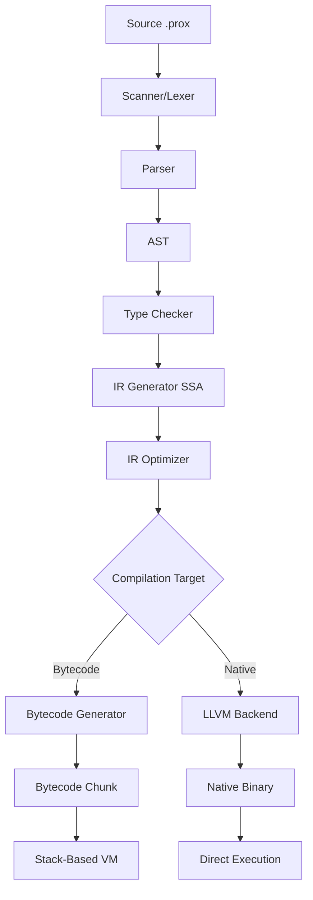

# ProXPL Design Philosophy & Architecture Decisions

**Document Version:** 1.0  
**Last Updated:** December 2024  
**Status:** Living Document

---

## Table of Contents

1. [Design Philosophy](#design-philosophy)
2. [Architecture Decisions](#architecture-decisions)
3. [Performance Strategy](#performance-strategy)
4. [Future Roadmap](#future-roadmap)
5. [Trade-offs & Rationale](#trade-offs--rationale)

---

## Design Philosophy

### Core Principles

ProXPL is designed around four fundamental principles:

1. **🎯 Clarity Over Cleverness**
   - Code should be self-documenting
   - Explicit is better than implicit
   - Readable syntax inspired by JavaScript and Python

2. **⚡ Performance Without Compromise**
   - C-level execution speed as the baseline
   - Multiple optimization tiers (Interpreter → JIT → AOT)
   - Zero-cost abstractions where possible

3. **🛡️ Safety by Default**
   - Static type checking prevents runtime errors
   - Garbage collection eliminates manual memory management
   - Bounds checking on all array/dict access

4. **🔧 Pragmatic Simplicity**
   - Batteries-included standard library
   - Integrated tooling (PRM, LSP, debugger)
   - Cross-platform from day one

### Language Goals

**What ProXPL IS:**
- ✅ A general-purpose programming language
- ✅ Statically typed with type inference
- ✅ High-performance via bytecode VM and LLVM AOT
- ✅ Memory-safe with automatic GC
- ✅ **Multi-Paradigm**: Seamless Integration of **OOP**, **IOP**, and **COP**
- ✅ Suitable for systems programming, scripting, and applications

**What ProXPL is NOT:**
- ❌ A scripting language without types
- ❌ A low-level systems language like C/Rust
- ❌ A purely functional language
- ❌ A domain-specific language

---

## Architecture Decisions

### 1. Compilation Pipeline



**Rationale:**
- **Multi-phase design** allows independent optimization of each stage
- **SSA IR** enables powerful optimizations (constant folding, DCE, CSE)
- **Dual backend** provides flexibility: fast iteration (bytecode) vs. production (native)

### 2. Virtual Machine Architecture

**Decision: Stack-Based VM**

**Alternatives Considered:**
- Register-based VM (like Lua 5.0+)
- Direct AST interpretation
- Transpilation to JavaScript/C

**Why Stack-Based:**
- ✅ Simpler bytecode generation
- ✅ Smaller bytecode size (fewer operands)
- ✅ Easier to implement and debug
- ✅ Good performance with threaded dispatch
- ✅ Natural fit for expression evaluation

**Trade-off:**
- ⚠️ More instructions than register VM
- ⚠️ More stack operations

**Mitigation:**
- Threaded dispatch (computed goto) reduces overhead
- IR-level optimizations reduce instruction count
- Future: Hybrid stack/register model

### 3. Value Representation

**Decision: NaN-Boxing**

```c
// 64-bit value encoding
typedef uint64_t Value;

// IEEE 754 double: Normal numbers
// QNaN payload: Other types
#define QNAN     0x7ffc000000000000
#define SIGN_BIT 0x8000000000000000

// Encoding:
// - Numbers: Raw IEEE 754 double
// - Null: QNaN | TAG_NULL
// - Bool: QNaN | TAG_TRUE/FALSE
// - Objects: SIGN_BIT | QNaN | pointer
```

**Alternatives Considered:**
- Tagged unions (8-16 bytes per value)
- Pointer tagging (limited to 32-bit pointers)
- Separate type and value fields

**Why NaN-Boxing:**
- ✅ Single 64-bit value (fits in register)
- ✅ Zero overhead for numbers (most common type)
- ✅ Fast type checking (single comparison)
- ✅ Excellent cache locality
- ✅ Used by production VMs (JavaScriptCore, LuaJIT)

**Trade-off:**
- ⚠️ Complex bit manipulation
- ⚠️ Platform-specific (assumes IEEE 754)

### 4. Garbage Collection

**Decision: Mark-and-Sweep GC**

**Current Implementation:**
- Tri-color marking algorithm
- Stop-the-world collection
- Triggered by allocation threshold

**Future Evolution:**
```
Phase 1: Mark-and-Sweep (Current)
    ↓
Phase 2: Generational GC (v1.2)
    ↓
Phase 3: Concurrent Marking (v1.5)
    ↓
Phase 4: Incremental Collection (v2.0)
```

**Rationale:**
- Start simple, optimize later
- Mark-and-sweep is well-understood
- Easy to implement correctly
- Foundation for advanced techniques

### 5. Type System

**Decision: Static Typing with Inference**

```javascript
// Type inference
let x = 42;           // Inferred: int
let name = "Alice";   // Inferred: string

// Explicit types (optional)
let count: int = 0;
func add(a: int, b: int): int {
    return a + b;
}
```

**Alternatives Considered:**
- Dynamic typing (Python-style)
- Gradual typing (TypeScript-style)
- Full Hindley-Milner inference

**Why Static + Inference:**
- ✅ Catches errors at compile-time
- ✅ Enables optimizations
- ✅ Better IDE support
- ✅ Optional annotations for clarity
- ✅ Familiar to developers (TypeScript, Swift, Kotlin)

### 6. Module System

**Decision: File-Based Modules with `use` Keyword**

```javascript
use std.math;        // Standard library
use http.client;     // Package
use ./local_helper;  // Local file
```

**Resolution Order:**
1. Standard library (`stdlib/`)
2. Installed packages (`prox_modules/`)
3. Relative paths (`./ ../`)

**Rationale:**
- Simple and predictable
- No magic import paths
- Clear distinction between stdlib and packages
- Compatible with package managers

---

## Performance Strategy

### Execution Tiers

ProXPL uses a **tiered compilation** strategy:

```
Tier 0: Interpreter (Bytecode VM)
    ↓ (Hot function detected)
Tier 1: Baseline JIT (Template JIT) [Planned]
    ↓ (Very hot function)
Tier 2: Optimizing JIT (LLVM) [Planned]
    ↓ (Ahead-of-time)
Tier 3: AOT Compilation (LLVM Backend) [Current]
```

### Current Optimizations

**Compile-Time:**
- ✅ Constant folding
- ✅ Dead code elimination
- ✅ Common subexpression elimination
- ✅ String interning

**Runtime:**
- ✅ NaN-boxing (fast value operations)
- ✅ Threaded dispatch (GCC/Clang)
- ✅ Inline caching (planned)

### Planned Optimizations

**v1.2 - Baseline JIT:**
- Template-based JIT compilation
- 2-5x speedup over interpreter
- Low compilation overhead

**v1.5 - Optimizing JIT:**
- Type specialization
- Inlining
- Escape analysis
- 10-20x speedup for hot code

**v2.0 - Advanced:**
- Speculative optimization
- Deoptimization support
- Profile-guided optimization

### Benchmark Targets

| Benchmark | Current | Target (v1.5) | Target (v2.0) |
|-----------|---------|---------------|---------------|
| Fibonacci(30) | 0.15s | 0.05s | 0.02s |
| Mandelbrot | 2.3s | 0.8s | 0.3s |
| Binary Trees | 1.8s | 0.6s | 0.2s |

**Baseline:** C = 1.0x, Python = 0.1x, Lua = 0.8x

---

## Future Roadmap

### Short-Term (v1.1-1.2)

**Focus: Developer Experience**

- 🔧 LSP server (autocomplete, go-to-definition, diagnostics)
- 🐛 Source-level debugger
- 📦 PRM registry service
- ⚡ Baseline JIT compiler
- 🧪 Comprehensive test suite

### Medium-Term (v1.3-1.5)

**Focus: Language Features**

- 🎯 Pattern matching
- 🔄 Async/await
- 📐 Generics
- 🎨 Algebraic data types
- 🔗 Trait system

### Long-Term (v2.0+)

**Focus: Performance & Ecosystem**

- 🚀 Optimizing JIT (LLVM-based)
- 🌐 WebAssembly target
- 🔀 Concurrent GC
- 📊 Advanced profiling tools
- 🏗️ Build system integration

---

## Trade-offs & Rationale

### 1. Stack-Based vs Register-Based VM

**Decision:** Stack-based

**Trade-off:**
- ➕ Simpler implementation
- ➕ Smaller bytecode
- ➖ More instructions
- ➖ More stack operations

**Rationale:** Simplicity wins for initial implementation. Can evolve to hybrid model later.

### 2. Garbage Collection vs Manual Memory

**Decision:** Garbage collection

**Trade-off:**
- ➕ Memory safety
- ➕ Developer productivity
- ➖ GC pauses
- ➖ Memory overhead

**Rationale:** Safety and productivity are priorities. GC can be optimized (generational, concurrent).

### 3. Static vs Dynamic Typing

**Decision:** Static typing with inference

**Trade-off:**
- ➕ Compile-time error detection
- ➕ Better performance
- ➕ IDE support
- ➖ More verbose (sometimes)
- ➖ Longer compilation

**Rationale:** Type safety and performance outweigh flexibility. Inference reduces verbosity.

### 4. Bytecode VM vs Direct Compilation

**Decision:** Both (bytecode for development, LLVM for production)

**Trade-off:**
- ➕ Fast iteration (bytecode)
- ➕ Maximum performance (LLVM)
- ➖ Complexity of maintaining two backends

**Rationale:** Best of both worlds. Bytecode for development, native for deployment.

### 5. Custom VM vs Existing Runtime

**Decision:** Custom VM

**Alternatives:** Target JVM, CLR, WASM, or JavaScript

**Trade-off:**
- ➕ Full control over optimizations
- ➕ Tailored to language semantics
- ➕ No runtime dependencies
- ➖ More implementation work
- ➖ Smaller ecosystem

**Rationale:** Control and performance justify the effort. Can add WASM target later.

---

## Design Constraints

### Must Have

1. **Cross-Platform:** Windows, Linux, macOS from day one
2. **Zero Dependencies:** Standalone binaries
3. **C Interop:** FFI for calling C libraries
4. **Backward Compatibility:** Semver guarantees post-1.0

### Nice to Have

1. **Hot Reloading:** Code changes without restart
2. **REPL:** Interactive development
3. **Package Registry:** Centralized package repository
4. **IDE Plugins:** VSCode, JetBrains, Vim

### Won't Have (For Now)

1. **Macros:** Too complex for v1.0
2. **Reflection:** Security and performance concerns
3. **Multiple Inheritance:** Complexity vs. benefit
4. **Operator Overloading:** Can be confusing

---

## Lessons Learned

### From Other Languages

**Python:**
- ✅ Readable syntax
- ✅ Batteries-included philosophy
- ❌ Performance limitations
- ❌ GIL threading issues

**JavaScript:**
- ✅ Ubiquitous and familiar
- ✅ Event-driven model
- ❌ Weak typing pitfalls
- ❌ Callback hell

**Lua:**
- ✅ Simple, fast VM
- ✅ Excellent embedding
- ❌ Limited standard library
- ❌ 1-indexed arrays (confusing)

**Go:**
- ✅ Fast compilation
- ✅ Great concurrency
- ❌ Verbose error handling
- ❌ No generics (until recently)

**Rust:**
- ✅ Memory safety without GC
- ✅ Zero-cost abstractions
- ❌ Steep learning curve
- ❌ Long compilation times

### ProXPL's Approach

Take the best from each:
- Python's readability
- JavaScript's familiarity
- Lua's VM simplicity
- Go's pragmatism
- Rust's safety (via types + GC)

---

## Open Questions

### Under Discussion

1. **Concurrency Model:**
   - Option A: Go-style goroutines
   - Option B: Actor model (Erlang-style)
   - Option C: Async/await (JavaScript-style)
   - **Current Lean:** Async/await for familiarity

2. **Error Handling:**
   - Option A: Exceptions (try/catch)
   - Option B: Result types (Rust-style)
   - Option C: Multiple return values (Go-style)
   - **Current Lean:** Hybrid (exceptions + Result types)

3. **Null Safety:**
   - Option A: Nullable by default
   - Option B: Non-nullable by default (Kotlin-style)
   - **Current Lean:** Nullable by default, with `?` operator

### Deferred Decisions

- Macro system design
- Reflection API
- Compile-time code generation
- Plugin architecture

---

## References

- **Crafting Interpreters** by Robert Nystrom
- **Engineering a Compiler** by Cooper & Torczon
- **Modern Compiler Implementation in C** by Appel
- **Garbage Collection Handbook** by Jones et al.
- **LuaJIT Internals** by Mike Pall
- **V8 Design Elements** (Google)

---

## Conclusion

ProXPL's design prioritizes **clarity, performance, and safety** through:

1. **Clean Architecture:** Multi-phase compilation with clear separation
2. **Proven Techniques:** NaN-boxing, mark-and-sweep GC, SSA IR
3. **Pragmatic Choices:** Stack VM now, JIT later; static types with inference
4. **Future-Proof:** Designed for evolution (JIT, concurrent GC, WASM)

The language is **production-ready** for its current scope while maintaining a clear path to world-class performance.

---

<p align="center">
  <b>ProXPL - Thoughtfully Designed, Carefully Implemented</b>
</p>
